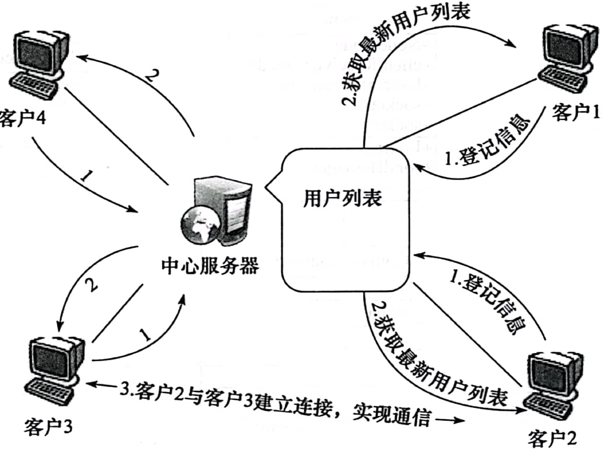
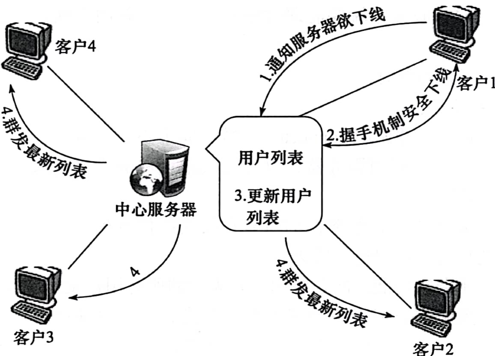
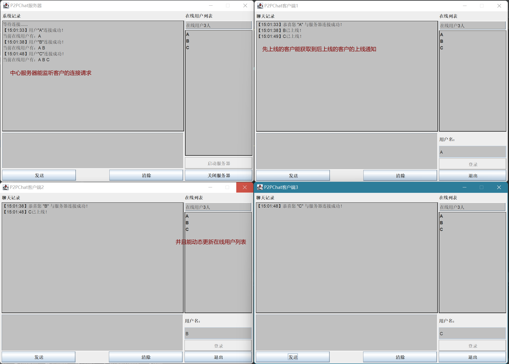
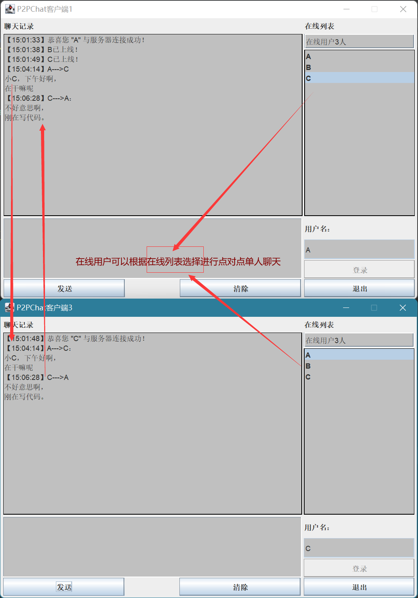
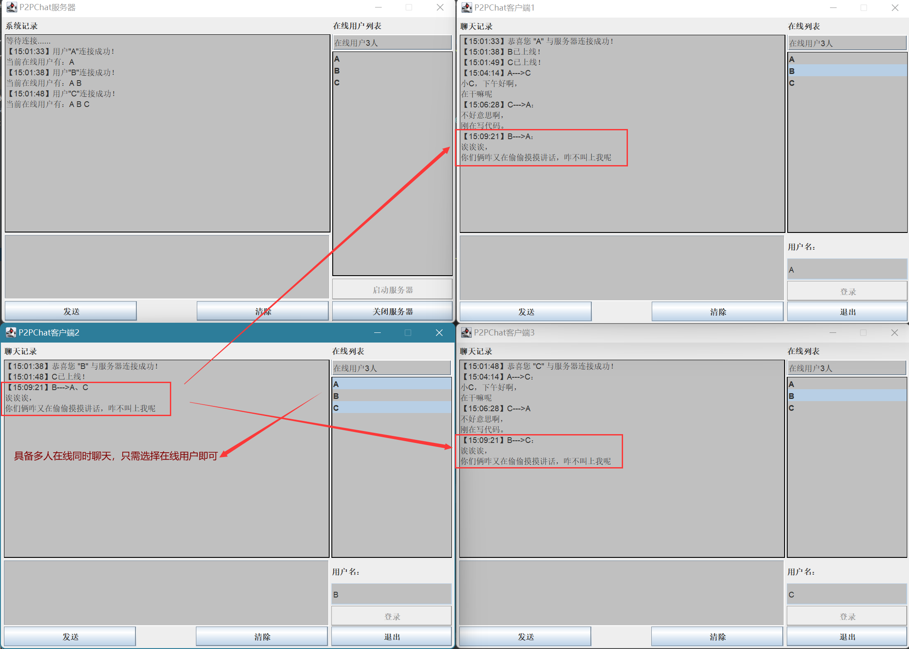
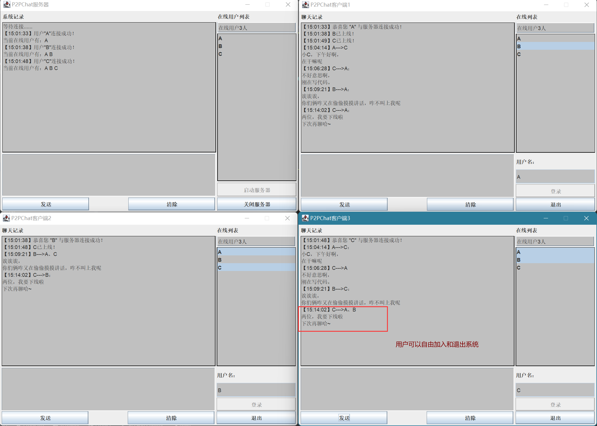
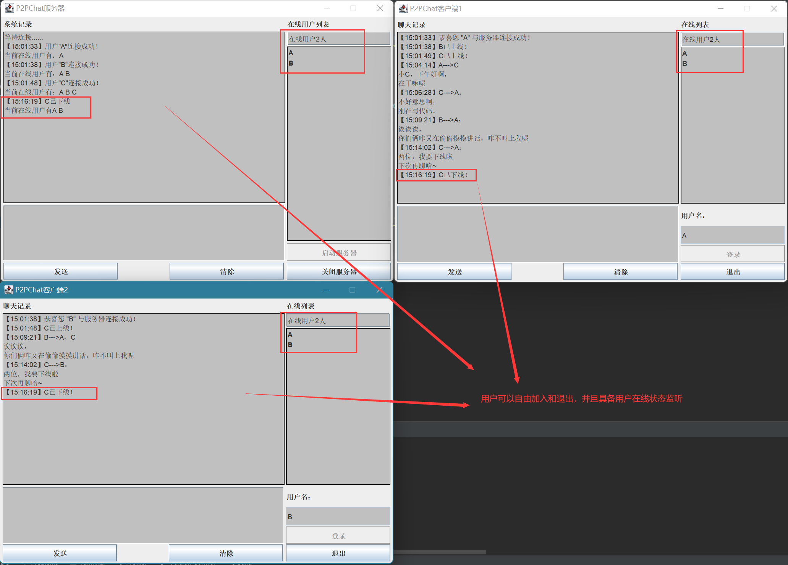

# 基于P2P范型的即时聊天系统

## 一、实验目的

使用Java Socket来实现一个简单的基于P2P范型的即时聊天系统。实践开发主要涉及的技术是Java Socket编程和多线程技术。  

## 二、实验要求

分析系统需要实现的功能，由于演示的是简单的P2P即时聊天系统，因此，我们仅仅设计了如下几个功能：点对点单人聊天、多人同时在线聊天、用户可以自由加人和退出系统、具备用户在线状态监视。采用类似于中心化拓扑结构P2P模式，所有客户都需要与中心服务器相连，并将自己的网络地址写人服务器中，服务器只需要监听和更新用户列表信息，并发送给客户最新的用户列表信息即可。当需要点对点聊天时，客户端只需要从本地用户列表中读取日标用户的网络地址，并连接目标用户，即可实现通信。因为是P2P系统，客户端要同时扮演服务器和客户端两个角色，所以，用户登录后都会创建一个接收其他用户连接的监听线程，以实现服务器的功能。其中，中心服务器和客户端需要实现的任务如下：  

1. 中心服务器的主要任务：  
   1. 创建`Socket`、绑定地址和端口号，监听并接收客户端的连接请求。 
   2. 服务器端在客户连接后自动获取客户端用户名、`IP`地址和端口号，并将其保存在服务器端的用户列表中，同时更新所有在线用户的客户端在线用户列表信息，以方便客户了解上下线的实时情况，以进行聊天。  
   3. 当有用户下线时，服务器端要能即时监听到，并更新用户列表信息，发送给所有在线客户端。  
   4. 对在线用户数量进行统计。  
2. 客户端的主要任务：  
   1. 客户端创建`Socket`，并调用`connect()`函数，向中心服务器发送连接请求。 
   2. 客户端在登录后必须充当服务器，以接收其他用户的连接请求，所以需要创建一个用户接收线程来监听。  
   3. 用户登录后需要接收来自服务器的所有在线用户信息列表，并更新本地的用户列表信息，以方便选择特定用户进行聊天。  
   4. 客户端可以使用群发功能，向在线用户列表中的所有用户发送聊天信息。

## 三、实验步骤

### 3.1 系统总体设计

中心服务器启动后会自动创建一个监听线程，以接收客户端发来的连接请求。当客户端与服务器连接后，客户端会将自己的信息（用户名、IP地址和端口号等）写人Socket，服务器端从此Socket中读取该用户信息，并登记到用户信息列表中。然后，服务器将最新的用户信息列表群发给所有在线的客户端，以便客户端得到最新的用户列表。图3.1中步骤1、2展示了客户登录服务器的过程。  



 <div style="text-align: center;">图3.1 客户端与中心服务器连接过程</div> 

每个连接到中心服务器的客户都会得到最新的用户信息列表。如图3.1中步骤3所示，若客户2欲与客户3聊天，则客户2检索自己的用户信息列表，得到客户3的用户信息后，便可与客户3进行连接，实现通信。此过程并不需要中心服务器的干预。 

 当有一个客户需要下线时，如图3.2中的客户1，那么客户1首先将下线请求写人`Socket`，中心服务器接收到含有下线请求标记的信息后，客户1便通过握手机制下线（为了安全关闭`Socket`)。客户1安全下线后，中心服务器会将客户1的用户信息从在线列表中删除，并将更新后的用户列表、下线用户名称和当前网络的在线用户情况等群发给所有在线客户端以便客户端得到最新的在线用户列表。  


<div style="text-align: center;">图3.2 客户下线过程</div>

### 3.2 函数功能设计

#### 1）Server类和Client类

首先设计中心服务器和客户端系统界面。创建中心服务器`Server`类，派生自`JFrame`类，并创建按钮、文本框、列表等。同样，创建客户端`Client`类，也派生自`JFrame`类，并创建相应的组件。`Server`类和`Client`类都需要使用`eventListener()`函数，从而对界面上的按钮等动作进行监听。  

按钮上有个监听函数（可以理解为一个触发器，当按下时，就触发了这个事件，实际上就是调用了这个函数）。比如服务器的登录:  

```java
//登录
userLog.addActionListener(e -> {
   try {
       if (!userNameTextFile.getText().isEmpty()) {
           login();
       }
   } catch (IOException ex) {
       setChatRecord("用户名不能为空");
   }
});
```

当监听到有按下动作时，就调用`login()`函数，login函数中会启动一个监听线程，用户监听客户的连接请求。客户的也如此。  

`Server`类中除了包含系统界面上的一些组件成员外，还有用于维护在线用户信息的`UserInfo`对象、用于连接的`ServerSocket`对象和`Socket`对象，及用于`Socket`输人、输出流的对象。服务器生成后会进行相应的初始化，并监听服务器界面中的按钮动作，予以相应处理。  

当单击“启动服务器”按钮时，会触发调用`startServer()`方法，该方法为服务器选定特定的端口号，并创建服务器端监听线程`ServerListenThread`（服务器端监听线程类`ServerListenThread`的一个实例)，等待客户端的连接请求。同时，服务器还会创建一个线程`ServerReceiveThread`，用于接收客户端发来的下线请求，并将更新后的用户列表群发给所有用户。

`Client`类中除了包含系统界面上的一些组件成员外，还有用于设置聊天记录的函数`setChatRecord()`和发送聊天消息的函数`sendMessage()`。  

#### 2）Node类

创建`P2P`网络结点`Node`类，其中包含用户名、IP地址、端口号和布尔变量上线通知、下线通知和是否刚上线。  

#### 3）RandomPort类

创建`RandomPort`类，用于客户端分配随机可用端口号，由网络知识可知，可用端口号要小于65535。用Random类提供的方法生成一个随机端口值后，再用此端口来初始化`ServerSocket`对象，以检查此端口是否可用。

#### 4）ComWithServer类

当客户端与服务器连接后，会创建一个线程`ComWithServer`，用于将自己的信息发送给服务器，并获取服务器返回的最新用户列表。同时，客户端创建`ClientSendThread`线程，用于发送本端的聊天信息。此外，还创建了接收线程`ClientReceiveThread`，把自己当做服务器，接收来自其他客户端发来的信息。

#### 5）UserInfo类

创建用户列表类`Userlnfo`，用于维护中心服务器端和客户端的在线用户信息。`Userlnfo`类中含有一个`ArrayList<Node>`类型的`UserNodeList`属性，用于保存在线用户信息，以及一些向`UserNodeList`中添加用户结点、删除用户结点、统计用户列表结点数、按`Node.usermame`检素列表和按索引检素列表等行为。

#### 6）OnlineOfflineMessage类

`Record`类型，不可变。用来在类和应用程序之间传送数据，这里就是传送的Node节点信息。当服务器监听到有用户上线或者下线时，就将该用户节点信息写入服务器的 `OnlineOfflineMessage`类对象实例中。由于不可变性，所以服务器与其他在线客户的线程也能得到上线或者下线用户节点的正确信息。

####   7）ClientSendThread类和ClientReceiveThread类  

在客户端要发送消息时，根据选中“在线用户”列表获取用户名，然后根据用户名在`Userlnfo`中搜索该用户结点(存放了该用户的`ip`地址和端口号)，然后知道了`ip`地址和端口号，就可以创建连接、与另外一个客户端进行通信了。每次点击发送会创建一个线程用于客户端发送，每给一个客户发送完成后会关闭连接，给下一个客户发送再建立新的连接，给所有选中的客户发送完成后，该线程就结束。这部分的一对一通信和多人聊天本质一样，多人聊天通过遍历用户列表实现。

####   8）ServerListenThread类和ServerReceiveThread类 

中心服务器启动后会自动创建一个监听线程，以接收客户端发来的连接请求。当客户端与服务器连接后，客户端会将自己的信息（用户名、卫地址和端口号等）写入`Socket`，服务器端从此`Socket`中读取该用户信息，并登记到用户信息列表中。然后，服务器将最新的用户信息列表群发给所有在线的客户端，以便客户端得到最新的用户列表。

## 四、运行结果与分析

1. 运行`ServerTest.java`启动服务器端，再分别启动三个客户端，登录用户`A`、`B`、`C`并更新“在线用户列表”，如图4.1所示。

   
   <div style="text-align: center;">图4.1 连接</div>

2. `A`用户在“在线用户列表”选中用户`C`发送消息，如图4.2所示。

   
   <div style="text-align: center;">图4.2 单点通信</div>

3. `B`用户在“在线用户列表”选中用户`A`、`C`发送消息，如图4.3所示。

   
   <div style="text-align: center;">图4.3 一对多通信</div>

4. 用户可以自由退出，并且服务器和剩下在线用户能够监听到用户下线消息，并且更新列表如图4.4和图4.5所示。

   
   <div style="text-align: center;">图4.4 自由退出</div>

   
   <div style="text-align: center;">图4.5 实时监听</div>

## 五、实验中遇到的问题、解决方法及体会

### 5.1 问题一

在实验的过程中，关于如何将用户在线列表更新并发送给所有用户，我们最终使用了定时器任务。 

```Java
timer.schedule(new TimerTask() {
    @Override
    public void run() {
        StringBuilder userList = new StringBuilder();
        if (node != null && node.isOfflineInfo()) {
            userList.append("下线通知@@");
            userList.append(server.offlineMessage.node().toString());
            node.setOfflineInfo(false);
            try {
                updateInformation(userList);
            } catch (IOException e) {
                throw new RuntimeException(e);
            }
        } else if (node != null && node.isOnlineInfo()) {
            userList.append("上线通知@@");
            userList.append(server.onlineMessage.node().toString());
            node.setOnlineInfo(false);
            try {
                updateInformation(userList);
            } catch (IOException e) {
                throw new RuntimeException(e);
            }
        } else if (node != null && node.isJustOnline()) {
            userList.append("更新列表@@");
            userList.append(userInfo.toString());
            node.setJustOnline(false);
            try {
                updateInformation(userList);
            } catch (IOException e) {
                throw new RuntimeException(e);
            }
        }
    }
}, date, 1000);
```

  当新的用户上线后，为了使其他用户怎么得到这个消息，在``Node`节点中设置了三个布尔类型的变量：  

```java
private boolean isOnlineInfo;   //上线通知
private boolean isOfflineInfo;  //下线通知
private boolean isJustOnline;  //是否刚上线
```

举个例子：  

现在有`AB`两个客户在线，`C`客户要上线了。服务器监听到连接请求，所有就新产生了一个`C`的用户节点以及与新用户进行通信的`ServerReceiveThread`线程，然后服务器通过 `userInfo.setOnlineStatus(true)`函数把所有在线用户的节点的 `isOnlineInfo`变量设置成`true`，同时后面应该再跟一句 `node.setOnlineInfo(false)`（不给自己发通知，自己需要更新列表）；这样`ServerReceiveThread`线程就知道了有新用户上线，给在线客户发送这个用户的信息。下线通知也如此。  

这是个定时器，每隔一秒就会执行一次，相当于这个定时器（定时器本身也是一个独立的线程）就看看需不需要给在线用户发送上线/下线消息，或者给刚上线的用户发送列表消息。  

### 5.2 问题二

另外一个主要的问题就是发送消息的格式，接收到的消息怎么拆分出用户名，`IP`地址，端口号，或者当发送消息怎么组合在一起发送。这当中字符串的分割功不可没，就是`split`函数，另外由于系统中频繁的更新字符串消息，所以`StringBuilder`类也功不可没，用好这两个函数对本次编程中有极为重要的意义。
